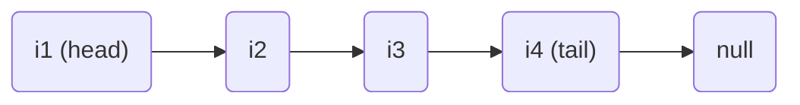
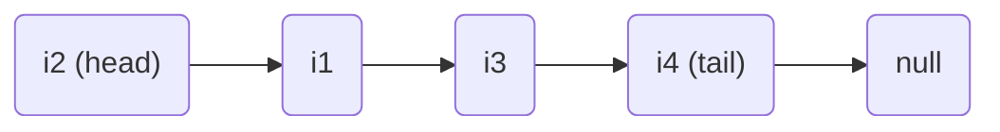
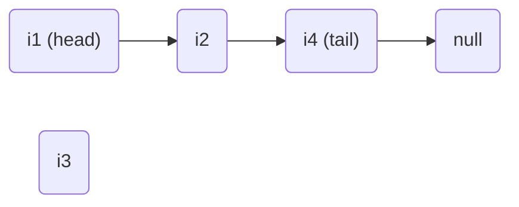
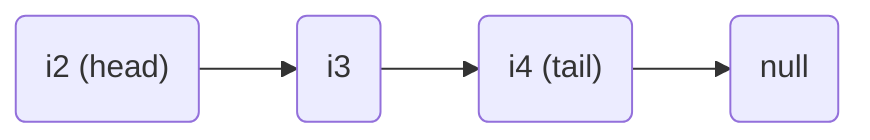
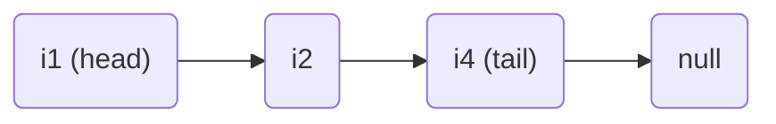

# Verkettete Listen
Sequentielle Listen haben den Nachteil, dass sie eine festgelegte Größe haben, die nicht verändert werden kann (siehe auch [Sequentielle Listen](Sequentielle-Listen.md)).

Bei verketteten Listen wird zusätzlich in Form einer Referenz (Adresse) gespeichert, an welcher Stelle sich das nächste Element befindet. Somit können die Element beliebig über den Speicher verstreut liegen (während bei einem Array ein zusammenhängender Speicherbereich verwendet wird).

Nachteil: es wird mehr Speicher benötigt

Der Beginn einer Liste wird durch eine Referenz (```head```) auf das erste Element dargestellt. Häufig gibt es auch eine Referenz auf das Ende der Liste (```tail```).



Jedes Element beinhaltet den eigenen Wert und die Referenz zum nächsten Element.  

> Verkettete Listen sind ***rekursive Datenstrukturen***, da man bei der Definition eines Elements dieser Datenstruktur den Verweis auf das nächste Element benötigt.  

```java
class ListElement<type> {
	private type value;
	private ListElement<type> next;
}
```


Häufig sind auch doppelt verkettete Listen anzutreffen, bei denen jedes Element die Referenzen zum Nachfolger und Vorgänger beinhalten.

## Einfügen

### Einfügen am Anfang einer verketteten Liste

#### Ausgangslage


#### Ergebnis


#### Operationen
- Element wird eingefügt mit Referenz auf das nächste Element (hier: ```i1```)
- ```head``` Referenz wird angepasst

#### Zeitaufwand
Beide Schritte sind mit konstantem Zeitaufwand möglich. Daher ergibt sich folgender Aufwand:  

Worst-case/best-case: $O(1)$

### Einfügen an bestimmter Position einer verketteten Liste (Index des Vorgängers bekannt)
Weiter wird angenommen, dass das neue Vorgängerlement anhand einer Referenz bekannt ist.

#### Ausgangslage


#### Ergebnis


#### Operationen
- Element wird eingefügt mit Referenz auf das nächste Element (hier: ```i4```)
- Referenz des Vorgängerelements (```i2```) wird angepasst (hier: von ```i4``` auf ```i3```).

#### Zeitaufwand
Beide Schritte sind mit konstantem Zeitaufwand möglich. Daher ergibt sich foglender Aufwand:

Worst-case/best-case: $O(1)$

## Einfügen an bestimmter Position einer verketteten Liste (Referenz des Vorgängers unbekannt)
Ist die Referenz nicht bekannt, muss man zur Stelle navigieren.
Zeitaufwand: siehe [Zeitaufwand Suche mit Index](Sequentielle-Listen.md#suchen)

## Entfernen
1. Entfernen zu Beginn der Liste  
Setze ```head``` (Referenz auf das erste Listnelement) auf den Nachfolger des bisherigen Listelements. Aufwand: $O(1)$
2. Entfernen an bestimmter Position einer Liste  
Ist die Position des zu entfernenden Elements bekannt (in Form einer Referenz), so genügt das Ändern der Referenzen. Aufwand: $O(1)$

### Entfernen vom Anfang einer verketteten Liste

#### Ausgangslage


#### Ergebnis


#### Operationen
- Referenz vom Vorgägnerelement auf das  Nachfolgerelement anpassen (hier: von ```i1``` auf ```i2```).
- Referenz vom Element auf den Nachfolger entfernen (hier: von ```i2``` auf ```null```)

#### Zeitaufwand
Beides ist mit konstanter Laufzeit möglich. Daher ergibt sich folgender Zeitaufwand:  

Worst-case/best-case: $O(1)$

### Entfernen von bestimmter Position einer verketteten Liste

#### Ausgangslage


#### Ergebnis


#### Operationen
- Referenz des Vorgängers auf den Nachfolger ändern (hier: von ```i3``` auf ```i4```)
- Referenz des Elements auf den Nachfolger entfernen (hier: von ```i4``` auf ```null```)

#### Zeitaufwand
Beide Operationen sind mit konstantem Zeitaufwand möglich. Daher ergibt sich:

Worst-case/best-case:

- $O(1)$, wenn die Position bekannt ist
- $O(n)$, wenn nur der Index bekannt ist (da die gesamt Liste durchlaufen werden muss)

## Suchen in verketteten Listen

1. Position unbekannt  
Ist die Position unbekannt, muss im schlimmsten Fall die ganze Liste durchlaufen werden. Zeitaufwand: Worst-case: $O(n)$
2. Position bekannt  
Ist die Indexposition bekannt, müssen alle vorherigen Elemente durchlaufen werden (da die jeweilige Referenz benötigt wird um zum nächsten Element zu navigieren). Aufwand: $O(n)$.

Bei ```Index 0``` ergibt sich ein Zeitaufwand von $O(1)$.  
Gleichermaßen verhält es sich, wenn die Liste eine Referenz für das letzten Element (```tail```) beinhaltet und auf das letzte Element zugegriffen werden soll.


## Iteration 
1. Positionierung auf Listenanfang (```head```)
2. Navigation über Referenzen bis kein Nachfolger mehr existiert

Zeitaufwand: $O(n)$

> **Achtung:** man soll nicht über einen Index iterieren!
> Wird etwa eine solche Struktur genutzt:
> ```java
> for (int i = 0, i  < x; i++) {
>     do something;
> }
> ```
> Dann wird für jeden Zugriff auf ein neues ```i``` die Liste wieder neu durchlaufen. Aufwand dann: $O(n^2)$!

# Java Klasse ```LinkedList```
Die Java-Klasse ```LinkedList``` realisiert eine verkettete Liste. Sie enthält neben der Referenz auf das nächste Element auch eine Referenz auf das vorherige Element (doppelt verkettete Liste).
Dies benötigt zwar mehr Speicherplatz, ist für viele Operationen aber schneller.

## Beispiel
```java
LinkedList<String> linkedList = new LinkedList<>();
```