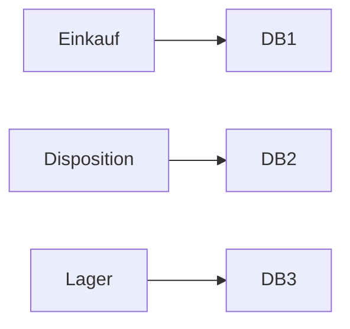
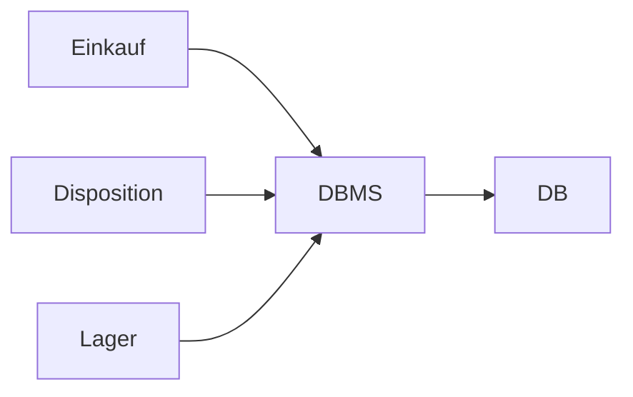
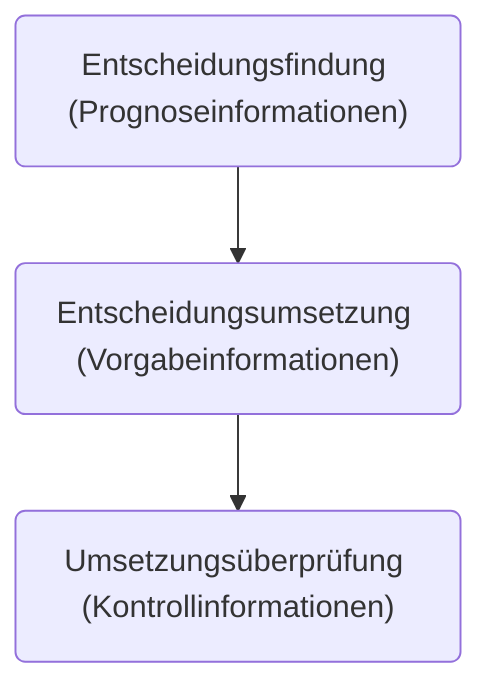

# 3.3 Betriebliche Informations- und Kommunikationssysteme
Ein betriebliches Informationssystem dient dazu, den betrieblichen Funktionen Daten effizient zur Verfügung zu stellen, sodass die Daten zur Wertschöpfung beitragen können.

Wenn ein Informationssystem (fast) alle Bereiche der Wertschöpfungskette eines Unternehmens betrifft, spricht man von einem ERP-System.

Es gibt unterschiedliche Ansätze, um ein ERP zu schaffen:

## Funktionsorientierte Vorgehensweise
Bei der funktionsorientierten Vorgehensweise werden alle Funktionen entlang der Wertschöpfungskette isoliert betrachtet (bspw. Einkauf, Disposition und Lager).
Zu jeder dieser Funktionen werden im Anschluss Datenstrukturen geschaffen und eigene Datenbestände angelegt.

Dies ist zwar ein pragmatischer Ansatz für die Einführung eines Informationssystems, führt in der Realität aber zu Redundanzen bei der Speicherung von Daten.

In der Folge wird es schwieriger, die Integrität der Daten sicherzustellen, da unterschiedliche Werte für die gleiche Information vorliegen können und Änderungen an allen Kopien der Daten vorgenommen werden müssen.

Außerdem wird die Auswertung der Daten über einzelne Funktionen hinweg erschwert, da die Daten bspw. in unterschiedlichen Versionen oder Formaten vorliegen können.

## Datenorientierte Vorgehensweise
Die datenorientierte Vorgehensweise stellt das Gegenteil zur funktionsorientierten Vorgehensweise dar. Hier werden nicht die Funktionen einzeln betrachtet, sondern es wird ein globales Datenmodell angestrebt.

Einzentrales Datenbankmanagementsystem (DBMS) übernimmt die Speicherung der Daten. Alle Funktionen im Unternehmen greifen auf diese zentrale Datenquelle zurück.

Es entstehen dadurch keine Redundanzen und die Auswertung über alle betrieblichen Funktionen wird erleichtert.

## Geschäftsprozessorientierte Vorgehensweise
Bei der geschäftsprozessorientierten Vorgehensweise stehen zunächst die Prozesse der Wertschöpfungskette im Vordergrund. Ziel ist, dass ein System geschaffen wird, welches alle Geschäftsprozesse der Wertschöpfungskette eines Unternehmens umfasst.

Dies ist vor allem dort interessant, wo nicht mehr alle Prozesse im eigenen Unternehmen liegen. Bspw. werden bei der Logistik mehr und mehr Prozessteile extern durchgeführt. Diese externen Partner müssen mit in das Informationssystem eingebunden werden.

## Bestandteile betrieblicher Informationssysteme
- Administrations- und Dispositionssysteme (Systeme der operativen Anwendung)
- Führungssysteme (Systeme zur Entscheidungs- und Planungsunterstützung)
- Querschnittssysteme (bereichsübergreifende Hilfssysteme, z.B. zur Kommunikation, oder Office-Anwendungen).

# Informationsarten
Informationen dienen dazu, die Entscheidungsfindung im Unternehmen zu unterstützen. Ihre Aufgabe ist es, die Unsicherheit beim Fällen von Entscheidungen zu reduzieren.

## Informationsgehalt
Es kann zwischen vollkommenen und unvollkommenen Informationen unterschieden werden.

##

## Zweckorientierte Klassifizierung
### Planungsinformationen
- notwendig zur Planung von Zielen
- helfen bei der Bestimmung von Handlungsalternativen

### Vorgabeinformationen
- dienen der Bestimmung von Zwischenzielen für Prozessschritte
- notwendig für die Koordination arbeitsteiliger Produktionsprozesse

### Kontrollinformationen
- dienen der Beurteilung von Ergebnissen

## Phasenorientierte Klassifizierung
Bei der phasenorientierten Klassifizierung wird davon ausgegangen, dass zunächst eine Entscheidung getroffen werden soll.
Daraus resultieren Vorgaben oder Handlugnsanweisungen zur Umsetzung dieser Entscheidung.
Zum Schluss wird die Realisierung der Entscheidung dann überprüft.

### Prognoseinformationen
- Prognoseinformationen beinhalten Informationen zu Handlungsalternativen, Voraussagen oder Beschränkungen.
- sie dienen damit der Entscheidungsfindung

### Vorgabeinformationen
- Vorgabeinformationen beinhalten Informationen zur Realisierung des Entscheidungsergebnisses
- sie dienen damit der Durchführung der zuvor getroffenen Entscheidung

### Kontrollinformationen
- dienen der Kontrolle der Realisierung
- bei Abweichungen zwischen Entscheidung und Realisierung beinhalten sie Informationen zur Revision

## Modalität von Informationne
- faktische Informationen
- prognostische Informationen
- explanatorische Informationen
- normative Informationen
- logische Informationen