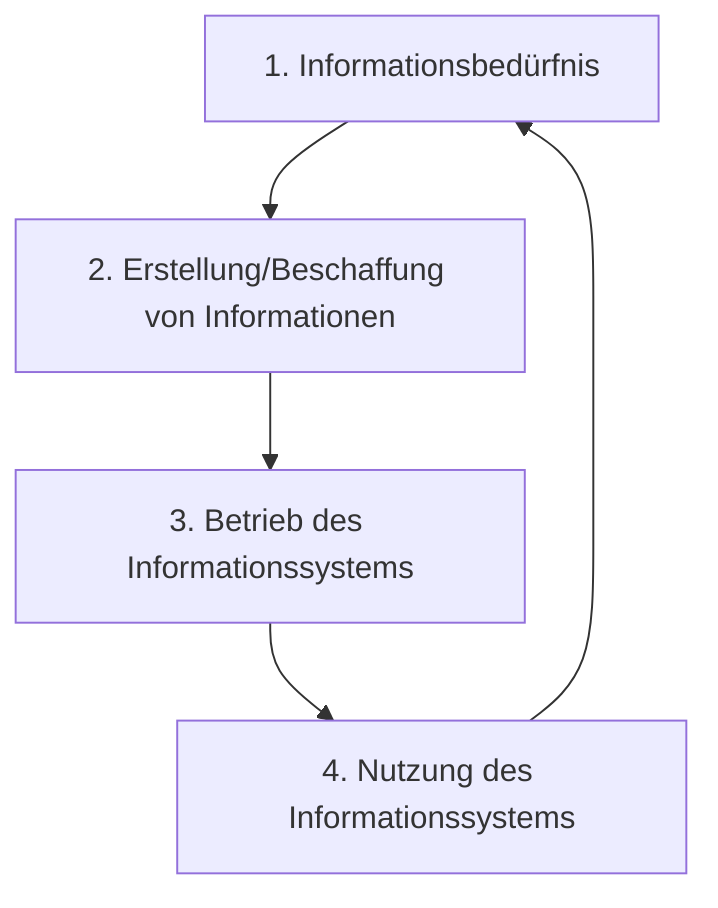

# Informationen als Produktionsfaktor
In der heutigen Zeit einer zunehmend digitalisierten Wirtschaft nehmen Informationen eine immer wichtigere Rolle ein. Informationen werden somit zu einem immer bedeutenderen Produktionsfaktor.

Diese Informationen müssen 
- zum richtigen Zeitpunkt
- in der für den Nutzungszweck notwendigen Qualität
- am richtigen Ort
zur Verfügung stehen.

## Informationslebenszyklus
Der Informationslebenszyklus bezeichnet die Phasen über den Verlauf einer Information. Dazu gehören:

1. Bedarfsbestimmung
2. Beschaffung
3. Organisation
4. Produktion
5. Distribution
6. Nutzung
7. Entsorgung

### 1. Informationsbedürfnis
Für die betriebliche Wertschöpfung werden Informationen benötigt. Wenn diese Nachfrage von vorhandenen Informationssystemen nicht befriedigt werden kann entsteht ein Informationsbedürfnis.

### 2. Erstellung/Beschaffung von Informationen
Das Informationsbedürfnis muss spezifiziert werden, damit die Informationen erstellt oder beschafft werden können.
Dies kann etwa die Erstellung eines neuen Informationssystems sein, oder die Änderung, Verbesserung oder Erweiterung eines vorhandenen Informationssystems.

### 3. Betrieb des Informationssystems
Nach der Erstellung/Beschaffung von informationen wird das neue/geänderte Informationssystem in das Unternehmen eingeführt und (technisch) betrieben.

### 4. Nutzung
Nach der Einführung des Informationssystems wird es von Anwendern genutzt. Diese Nutzung kann zu neuen Informationsbedürfnissen führen, womit der Zyklus von Neuem startet.

### (5. Migration)
Ein Informationssystem hat i.d.R. eine endliche Laufzeit. Das Informationsbedürfnis besteht aber zumeist länger. Daraus resultiert, dass Informationen in ein neues Informationssystem überführt werden müssen.