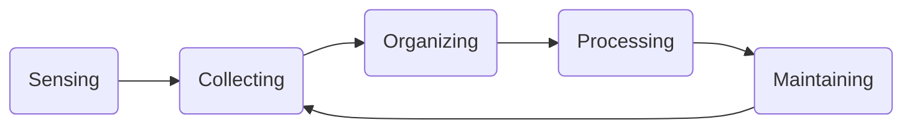

# Dimensionen der Informationsorientierung
In diesem Artikel werden die Begriffe der Informationsorientierung und das ganzheitliche Informationsmanagement beschrieben.

## Informationsorientierung
**Informationsorientierung** bezeichnet die Betrachtung nichttechnischer Faktoren im Informationsmanagement.

Die Informationsorientierung umfasst Forschungs- und Messmethoden, mit denen der Einfluss von Informationstechnologie auf den Unternehmenserfolg analysiert werden. Als Ergebnis stehen konkrete Aussagen darüber, wie IT so eingesetzt werden kann, dass der größtmögliche positive Einfluss auf den Geschäftserfolg erzielt wird.

Marchand et al. haben in ihren Forschungen gezeigt, dass Information Orientation sehr wohl einen messbaren Einfluss auf den Geschäftserfolg haben kann.  
Entscheidend ist dabei, dass die eingesetzten Funktionen und Fähigkeiten nicht isoliert betrachtet werden dürfen. Es kommt vielmehr auf das Zusammenwirken der einzelnen Komponenten „Mensch“ (und dessen Qualifikation), „Technik“ (und deren Funktionsfähigkeit), „Organisation“ (und deren Prozesse) und „Kommunikation“ (und deren Medien) an.

## Dimensionen der Informationsorientierung
Informationsorientierung besteht aus drei Dimensionen:

- Information Behaviors and Values / Fähigkeiten und Kultur beim Umgang mit Informationen
- Information Management Practices / Umsetzung operatives Informationsmanagementaufgaben
- Information Technology Practices / Breite des IT-Einsatzes

### Information Behaviors and Values
> Fähigkeit eines Unternehmens, die individuellen Wertvorstellungen (und damit das Verhalten) der Mitarbeiter im Umgang mit Informationen zu ermöglichen.  
> Wichtig ist dabei vor allem die Bewertung, ob definierte und angestrebte Rahmenbedingungen für einen effektiven Umgang mit Informationen vorhanden sind

#### Proaktivität
Anpassen von Anwendungen im Hintergrund mit serviceorientierter Interaktion im Vordergrund. Bspw. Erkennung eines Eingabefehlers und Vorschlag einer Korrektur.

#### Integrität
Vorurteilsfreie, zielgenaue und vertrauensvolle Grundeinstellung von Mitarbeiters zu Information und Kommunikation

#### Formalisierung
Einsatz eines definierten und dokumentierten Regelwerks.  
Hier: Fähigkeit, aus informellen Informationsquellen formale Informationen zu generieren. Bspw. wird in einem Seminar besprochen, wie fehlerbehaftete Handlungsweisen reduziert werden können. Das Unternehmen erstellt darauf basierend Handlungsanweisungen.

#### Kontrolle
Das Maß, in dem die Handlungen eines Mitarbeiters zum Geschäftserfolge beitragen.

#### Transparenz
Nutzung von Fehlern, Störungen und Unvorhersehbarkeit um hieraus zu lernen.  
Vier Eigenschaften bei Information Behaviors und Values:

- Mit den Gedanken anderer soll ohne Vorurteile umgegangen werden
- Gegenüber den Kunden, Lieferanten und den eigenen Mitarbeitern soll ein fairer Umgang gepflegt werden
- Das Unternehmen und die Führungsverantwortlichen stehen Vorschlägen und (neuen) Informationen offen gegenüber
- Das Verhältnis der Mitarbeiter untereinander ist von gegenseitigem Vertrauen geprägt.

#### Gemeinsame Nutzung und wechselseitiger Zugang
Ergebnis der vorherigen Kategorien. Transparente Informationspolitik führt dazu, dass Mitarbeiter vorhandene Informationen teilen und weitergeben.

### Information Management Practices
> Fähigkeit zur Umsetzung operativer Aufgaben des Informationsmanagements.  
> Zusammenfassung aller Fähigkeiten innerhalb der "Information Orientation", um Informationen über ihren gesamten Lebenszyklus hinweg zu managen.

Der Lebenszyklus von Informationen:

#### Phase Null - Sensing
- Erkennen, Beobachten, Identifizieren von besonderen Vorkommnissen aus dem externen Informationsfeld des Unternehmens

#### Phase Eins - Collecting
- Sammeln von relevanten Informationen zu den Vorkommnissen aus Phase Null.
- bspw. die Identifikation von Informationsbedürfnissen, Filtern der vorhandenen Informationen

#### Phase Zwei - Organizing
- Informationen
	- klassifizieren
	- strukturieren
	- für alle verfügbar machen

#### Phase Drei - Processing
- Informationsverarbeitung auf operativer Ebene
- besteht aus zwei Schritten
	- Sicherstellung des Zugangs zu den Informationsquellen
	- Analyse der Information und Ableitung von Wissen - dient danach als Entscheidungsgrundlage des Managers

#### Phase Vier - Maintaining
- Daten anderen zur Verfügung stellen (damit dies nicht mehrfach gesammelt, ausgewertet und strukturiert werden muss)
- Informationen aktuell halten, um hierdurch einen Informations- und Wissensvorsprung zu generieren

### Information Technology Practices
> Analyse und Dokumentation der Fähigkeit eines Unternehmens, die vorhandene IT-Infrastruktur (und dazugehörige Anwendungen) so effektiv einzusetzen, dass die unternehmensinternen Kommunikations- und Wertschöpfungsprozesse optimal unterstützt werden

Die IT-Infrastruktur ist demnach reines Unterstützungswerkzeug für die eigentlichen Wertschöpfungsprozesse.

Die Information Technology Practices bestehen aus vier Ebenen.

#### 1. Unterstützung operationaler Tätigkeiten durch IT / IT for Operational Support
Unterstützung bei Routeineaufgaben in der operativen Unternehmensebene.

#### 2. Geschäftsprozessunterstützung durch IT / IT for Business Support
- Fokus auf die Prozesse im Unternehmen.
- IT als Unterstützer möglichst aller Geschäftsprozesse enthalgn der Wertschöpfungskette.
- Unterstützung auch von Prozessen, die über das eigene Unternehmen hinaus wirken (Kunden, Lieferanten)

#### 3. Unterstützung von Innovation durch IT / IT for Innovation Support
- Unterstützung von Innovationen durch IT
- Ziel ist die Erhaltung von Wettbewerbsvorteilen durch Innovationstätigkeit

#### 4. Unterstützung von Managementtätigkeiten durch IT / IT for Managerial Support
- Unterstützung der Führungsebene durch IT
- Einsatz von IT zur Unterstützung von Entscheidungs- und Führungsprozessen, etwa zur Entscheidungsfindung

## Messindikatoren für die Verbesserung des Geschäftserfolgs
Die Verbesserung des Geschäftserfolgs lässt sich nicht einfach messen. Es gibt allerdings Indikatoren für die Verbesserung des Messerfolgs:

- Financial performance
	- Minimalprinzip des Wirtschaftens: Reduktion von Kosten
	- Maximalprinzip des Wirtschaftens: Steigerung der Erlöse
- Market Share Growth
	- Wachstum des Marktanteils
	- Messung der Marktdurchdringung mit den eigenen Produkten und Dienstleistungen
- Level or Product and Service Innovations
  - Produkt- und Serviceinnovationen
- Ability to Achieve a Superior Company Reputation
  - Erhöhung der Reputation des Unternehmens