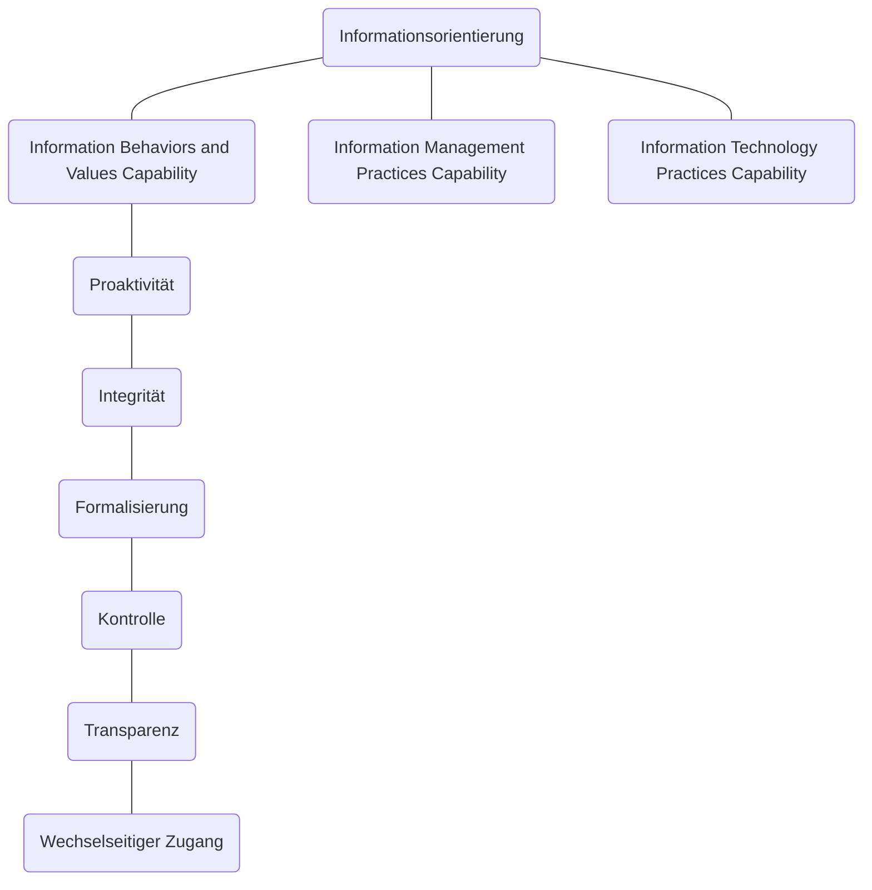

# Informationsorientierung
Der Begriff *Informationsorientierung* bezeichnet die nicht-technischen Aspekte des Informationsmanagements. Die Informationsorientierung wird häufig vernachlässigt, ist aber für die Informationsstrategie eines Unternehmens genauso wichtig wie die technischen Aspekte des Informationsmanagements.

Die Informationsorientierung besteht aus drei Dimensionen:

- [Informationsorientierung](#informationsorientierung)
  - [Information Behaviors and Values Capability](#information-behaviors-and-values-capability)
    - [Proaktivität](#proaktivität)
    - [Integrität](#integrität)
    - [Formalisierung](#formalisierung)
    - [Kontrolle](#kontrolle)
    - [Transparenz](#transparenz)
    - [Wechselseitiger Zugang](#wechselseitiger-zugang)
  - [Information Management Practices Capability](#information-management-practices-capability)
  - [Information Technology Practices Capability](#information-technology-practices-capability)

## Information Behaviors and Values Capability
Mit dem Begriff *Information Behaviors and Values Capability* wird die Fähigkeit eines Unternehmens beschrieben, die Werte und Fähigkeiten seiner Mitarbeiterinnen im Umgang mit Informationen zu sehen und zu nutzen und somit einen effektiven Umgang mit Informationen zu ermöglichen.

Die Kategorie wird anhand von sechs Bedingungen bewertet:

### Proaktivität
*Proaktivität* ist Fähigkeit von Informationssystemen, dem Anwender die richtigen Informationen und Features an der richtigen Stelle und zur richtigen Zeit anzuzeigen.  
Dies bedeutet, dass eine Anwenderin an der richtigen Stelle und zur richtigen Zeit die richtigen Informationen und Funktionen angezeigt bekommt.

### Integrität
Im Zusammenhang mit der Informationsorientierung meint *Integrität* die wert- bzw. Vorurteilsfreie Grundeinstellung der Anwenderin zu den Daten im Informationssystem.

!!! Achtung
    Dieser Begriff ist anders, als die technische Integrität von Daten (sind die gelesenen Daten dieselben wie die, die zuvor geschrieben wurden?) oder der Integritätsbegriff des Datenschutzes (haben nur die richtigen Personen Zugriff?).

### Formalisierung
Unter *Formalisierung* wird in der Informationsorientierung die Fähigkeit verstanden, aus informellen Daten (etwa die Inhalte eines Telefonats) formelle Informationen zu generieren (etwa eine formale Handlungsanweisung).

### Kontrolle
*Kontrolle* meint den Beitrag des Einzelnen zum Geschäftserfolg des Unternehmens und die Möglichkeiten des Managements, Mitarbeiterinnen zur effektiven Nutzung von Informationen zu verhelfen. 

### Transparenz
Transparenz bezeichnet den Umgang mit Störungen, Fehlern und sonstigen unvorhergesehenen Ereignissen.  
transparenz besteht aus vier Komponenten:

- Vorurteilsfreier Umgang mit den Gedanken anderer
- Fairer Umgang mit anderen
- neuen Ideen und Informationen offen gegenüberstehen
- Vertrauen zwischen den Mitarbeiterinnen

### Wechselseitiger Zugang
Der *wechselseitige Zugang* ist das Ergebnis der anderen fünf Dimensionen.  
Durch die Grundhaltung, den vertrauensvollen Umgang, die Fähigkeiten und die Kontrolle des Einzelnen werden die Mitarbeiterinnen des Unternehmens dazu angeregt, Informationen zu nutzen und zu teilen.

> Je besser das Betriebsklima, desto effizienter der Umgang mit Informationen.

## Information Management Practices Capability

## Information Technology Practices Capability