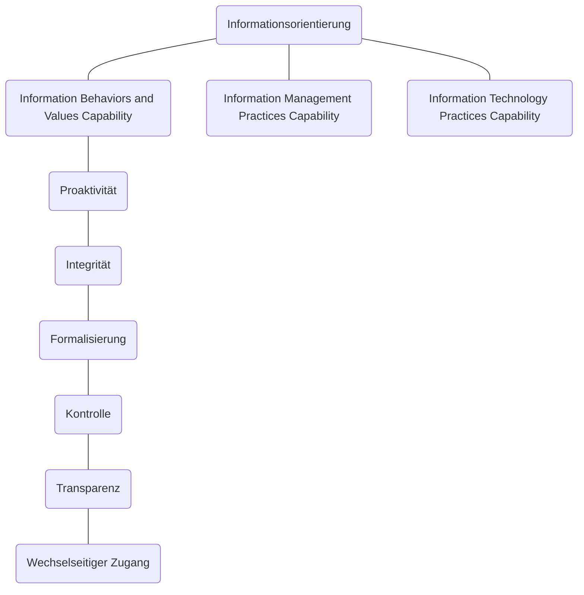
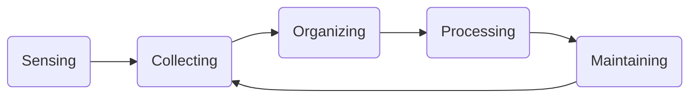

# Informationsorientierung
Der Begriff *Informationsorientierung* bezeichnet die nicht-technischen Aspekte des Informationsmanagements. Die Informationsorientierung wird häufig vernachlässigt, ist aber für die Informationsstrategie eines Unternehmens genauso wichtig wie die technischen Aspekte des Informationsmanagements.

Die Informationsorientierung umfasst Forschungs- und Messmethoden, mit denen der Einfluss von Informationstechnologie auf den Unternehmenserfolg analysiert werden. Als Ergebnis stehen konkrete Aussagen darüber, wie IT so eingesetzt werden kann, dass der größtmögliche positive Einfluss auf den Geschäftserfolg erzielt wird.

Marchand et al. haben in ihren Forschungen gezeigt, dass Information Orientation sehr wohl einen messbaren Einfluss auf den Geschäftserfolg haben kann.  
Entscheidend ist dabei, dass die eingesetzten Funktionen und Fähigkeiten nicht isoliert betrachtet werden dürfen. Es kommt vielmehr auf das Zusammenwirken der einzelnen Komponenten „Mensch“ (und dessen Qualifikation), „Technik“ (und deren Funktionsfähigkeit), „Organisation“ (und deren Prozesse) und „Kommunikation“ (und deren Medien) an.

Die Informationsorientierung besteht aus drei Dimensionen:

- [Informationsorientierung](#informationsorientierung)
  - [Information Behaviors and Values Capability](#information-behaviors-and-values-capability)
    - [Proaktivität](#proaktivität)
    - [Integrität](#integrität)
    - [Formalisierung](#formalisierung)
    - [Kontrolle](#kontrolle)
    - [Transparenz](#transparenz)
    - [Wechselseitiger Zugang](#wechselseitiger-zugang)
  - [Information Management Practices Capability](#information-management-practices-capability)
      - [Phase Null - Sensing](#phase-null---sensing)
      - [Phase Eins - Collecting](#phase-eins---collecting)
      - [Phase Zwei - Organizing](#phase-zwei---organizing)
      - [Phase Drei - Processing](#phase-drei---processing)
      - [Phase Vier - Maintaining](#phase-vier---maintaining)
  - [Information Technology Practices Capability](#information-technology-practices-capability)
      - [1. Unterstützung operationaler Tätigkeiten durch IT / IT for Operational Support](#1-unterstützung-operationaler-tätigkeiten-durch-it--it-for-operational-support)
      - [2. Geschäftsprozessunterstützung durch IT / IT for Business Support](#2-geschäftsprozessunterstützung-durch-it--it-for-business-support)
      - [3. Unterstützung von Innovation durch IT / IT for Innovation Support](#3-unterstützung-von-innovation-durch-it--it-for-innovation-support)
      - [4. Unterstützung von Managementtätigkeiten durch IT / IT for Managerial Support](#4-unterstützung-von-managementtätigkeiten-durch-it--it-for-managerial-support)
  - [Messindikatoren für die Verbesserung des Geschäftserfolgs](#messindikatoren-für-die-verbesserung-des-geschäftserfolgs)

## Information Behaviors and Values Capability
Mit dem Begriff *Information Behaviors and Values Capability* wird die Fähigkeit eines Unternehmens beschrieben, die Werte und Fähigkeiten seiner Mitarbeiterinnen im Umgang mit Informationen zu sehen und zu nutzen und somit einen effektiven Umgang mit Informationen zu ermöglichen.

Die Kategorie wird anhand von sechs Bedingungen bewertet:

### Proaktivität
*Proaktivität* ist Fähigkeit von Informationssystemen, dem Anwender die richtigen Informationen und Features an der richtigen Stelle und zur richtigen Zeit anzuzeigen.  
Dies bedeutet, dass eine Anwenderin an der richtigen Stelle und zur richtigen Zeit die richtigen Informationen und Funktionen angezeigt bekommt.

### Integrität
Im Zusammenhang mit der Informationsorientierung meint *Integrität* die wert- bzw. Vorurteilsfreie Grundeinstellung der Anwenderin zu den Daten im Informationssystem.

!!! Achtung
    Dieser Begriff ist anders, als die technische Integrität von Daten (sind die gelesenen Daten dieselben wie die, die zuvor geschrieben wurden?) oder der Integritätsbegriff des Datenschutzes (haben nur die richtigen Personen Zugriff?).

### Formalisierung
Unter *Formalisierung* wird in der Informationsorientierung die Fähigkeit verstanden, aus informellen Daten (etwa die Inhalte eines Telefonats) formelle Informationen zu generieren (etwa eine formale Handlungsanweisung).

### Kontrolle
*Kontrolle* meint den Beitrag des Einzelnen zum Geschäftserfolg des Unternehmens und die Möglichkeiten des Managements, Mitarbeiterinnen zur effektiven Nutzung von Informationen zu verhelfen. 

### Transparenz
Transparenz bezeichnet den Umgang mit Störungen, Fehlern und sonstigen unvorhergesehenen Ereignissen.  
transparenz besteht aus vier Komponenten:

- Vorurteilsfreier Umgang mit den Gedanken anderer
- Fairer Umgang mit anderen
- neuen Ideen und Informationen offen gegenüberstehen
- Vertrauen zwischen den Mitarbeiterinnen

### Wechselseitiger Zugang
Der *wechselseitige Zugang* ist das Ergebnis der anderen fünf Dimensionen.  
Durch die Grundhaltung, den vertrauensvollen Umgang, die Fähigkeiten und die Kontrolle des Einzelnen werden die Mitarbeiterinnen des Unternehmens dazu angeregt, Informationen zu nutzen und zu teilen.

> Je besser das Betriebsklima, desto effizienter der Umgang mit Informationen.

## Information Management Practices Capability
> Fähigkeit zur Umsetzung operativer Aufgaben des Informationsmanagements.  
> Zusammenfassung aller Fähigkeiten innerhalb der "Information Orientation", um Informationen über ihren gesamten Lebenszyklus hinweg zu managen.

Der Lebenszyklus von Informationen:

#### Phase Null - Sensing
- Erkennen, Beobachten, Identifizieren von besonderen Vorkommnissen aus dem externen Informationsfeld des Unternehmens

#### Phase Eins - Collecting
- Sammeln von relevanten Informationen zu den Vorkommnissen aus Phase Null.
- bspw. die Identifikation von Informationsbedürfnissen, Filtern der vorhandenen Informationen

#### Phase Zwei - Organizing
- Informationen
	- klassifizieren
	- strukturieren
	- für alle verfügbar machen

#### Phase Drei - Processing
- Informationsverarbeitung auf operativer Ebene
- besteht aus zwei Schritten
	- Sicherstellung des Zugangs zu den Informationsquellen
	- Analyse der Information und Ableitung von Wissen - dient danach als Entscheidungsgrundlage des Managers

#### Phase Vier - Maintaining
- Daten anderen zur Verfügung stellen (damit dies nicht mehrfach gesammelt, ausgewertet und strukturiert werden muss)
- Informationen aktuell halten, um hierdurch einen Informations- und Wissensvorsprung zu generieren

## Information Technology Practices Capability
> Analyse und Dokumentation der Fähigkeit eines Unternehmens, die vorhandene IT-Infrastruktur (und dazugehörige Anwendungen) so effektiv einzusetzen, dass die unternehmensinternen Kommunikations- und Wertschöpfungsprozesse optimal unterstützt werden

Die IT-Infrastruktur ist demnach reines Unterstützungswerkzeug für die eigentlichen Wertschöpfungsprozesse.

Die Information Technology Practices bestehen aus vier Ebenen.

#### 1. Unterstützung operationaler Tätigkeiten durch IT / IT for Operational Support
Unterstützung bei Routeineaufgaben in der operativen Unternehmensebene.

#### 2. Geschäftsprozessunterstützung durch IT / IT for Business Support
- Fokus auf die Prozesse im Unternehmen.
- IT als Unterstützer möglichst aller Geschäftsprozesse enthalgn der Wertschöpfungskette.
- Unterstützung auch von Prozessen, die über das eigene Unternehmen hinaus wirken (Kunden, Lieferanten)

#### 3. Unterstützung von Innovation durch IT / IT for Innovation Support
- Unterstützung von Innovationen durch IT
- Ziel ist die Erhaltung von Wettbewerbsvorteilen durch Innovationstätigkeit

#### 4. Unterstützung von Managementtätigkeiten durch IT / IT for Managerial Support
- Unterstützung der Führungsebene durch IT
- Einsatz von IT zur Unterstützung von Entscheidungs- und Führungsprozessen, etwa zur Entscheidungsfindung

## Messindikatoren für die Verbesserung des Geschäftserfolgs
Die Verbesserung des Geschäftserfolgs lässt sich nicht einfach messen. Es gibt allerdings Indikatoren für die Verbesserung des Messerfolgs:

- Financial performance
	- Minimalprinzip des Wirtschaftens: Reduktion von Kosten
	- Maximalprinzip des Wirtschaftens: Steigerung der Erlöse
- Market Share Growth
	- Wachstum des Marktanteils
	- Messung der Marktdurchdringung mit den eigenen Produkten und Dienstleistungen
- Level or Product and Service Innovations
  - Produkt- und Serviceinnovationen
- Ability to Achieve a Superior Company Reputation
  - Erhöhung der Reputation des Unternehmens