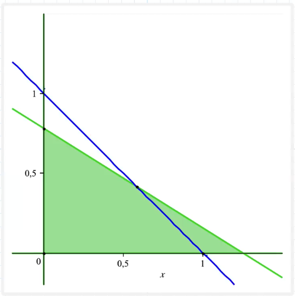
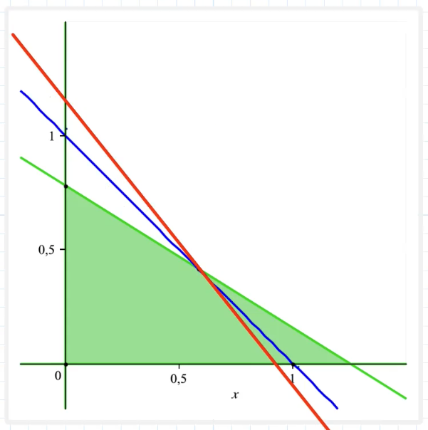

# Lineare Optimierung
Bei der Linearen Optimierung handelt es sich um eine Form der mathematische Optimierung.
Dabei wird ein gewünschtes Outcome unter Beachtung von Restriktionen maximiert oder minimiert.

## Beispiel: Kostenoptimierung einer Rezeptur
Ein Metzger stellt sein Hackfleisch gemischt aus Schweinefleisch und Rinderfleisch her.
- Rindfleisch
	- 20% Fett
	- 2,35€ pro kg
- Schweinefleisch
	- 32% Fett
	- 2,05€ pro kg
- Der Metzger garantiert einen Fettanteil von höchstens 25%
- Mit welchem Mischungsverhältnis kann der Metzger sein Hackfleisch zu minimalen Kosten herstellen?

$x$ = Gewicht Rindfleisch in kg  
$y$ = Gewicht Schweinefleisch in kg

### Formel zur Preisberechnung:
Der Preis eines Kilogramms Hackfleich lässt sich wie folgt berechnen: $z = 2,35 x + 2,05y$

## Restriktionen
1. Das Hackfleisch soll höchstens 25% Fett haben:  
   $0,2x + 0,32y ≤ 0,25$ --> grüner Bereich
2. Die Mengen von Rind- und Schweinefleisch sollen zusammen 1kg ergeben  
   $x+y = 1$ --> blaue Gerade
3. Die Gewichte sind nicht-negative reelle Zahlen  
   $x ≥ 0$, $y ≥ 0$ --> Quadrant im Koordinatensystem

## Grafische Darstellung Fettanteil und Gewicht

> Die Schnittmenge von Blau und Grün zeigt die zulässigen Werte für $x$ und $y$

### Berechnung 1. Restriktion - Fettanteil

$0,2x + 0,32y = 0,25$

Wenn $x=0$:
$$
0,2 ⋅ 0 ⋅ 0,32 ⋅ y = 0,25
$$
$$
= 0,32y = 0,25 | ∶0,32  
$$
$$
= y = 0,25 ∶ 0,32  
$$
$$
= y = 0,78  
$$

Wenn $y = 0$
$$
0,2x + 0,32 ⋅ 0 = 0,25
$$
$$
= 0,2x = 0,25 | ∶0,2
$$
$$
= x = 0,25∶0,2  
$$
$$
= y = 1,25
$$

### Berechnung 2. Restriktion - 1 kg
- Wenn $x = 0$ --> $y = 1$  
- Wenn $x = 1$ --> $y = 0$

Formel für die Gerade: $f(x) = -1 x + 1$

### 3. Kostenoptimierung
1. Formel zur Preisberechnung:  $z = 2,35x + 2,05y$  
2. nach $y$ auflösen:  
   $z = 2,35x + 2,05y | -2,35x$  
   $2,05y = -2,35x + z | ∶ 2,05$  
   $y = -\frac{2,35}{2,05} x + \frac{z}{2,05}$

Eine Gerade mit der Steigung $-\frac{2,35}{2,05}$ ergibt an ihrem Schnittpunkt mit der Geraden für die Restriktion des Gewichtes und der Fläche für die Restriktion des Fettanteils den optimalen Wert:

Optimaler Wert für x: $\frac{7}{12}$  
Optimaler Wert für y: $\frac{5}{12}$

Die optimalen Kosten:
$z = 2,35 ⋅ \frac{7}{12} + 2,05 ⋅ \frac{5}{12}$  
$z = 2,22$